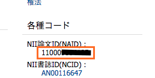
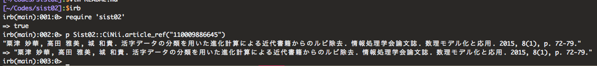

# Sist02

This gem provides easy way to make SIST-02 formed references.

Sist02::CiNii is based on [caps](https://github.com/Yousack/caps)

## Installation

Add this line to your application's Gemfile:

```ruby
gem 'sist02'
```

And then execute:

    $ bundle

Or install it yourself as:

    $ gem install sist02

## Usage

You get naid in [cinii article](http://ci.nii.ac.jp/) page.

naid is following (please input as String).



```ruby
require 'sist02'

naid = "110009886645"
p Sist02::CiNii.article_ref(naid)
#=> "粟津 妙華, 高田 雅美, 城 和貴. 活字データの分類を用いた進化計算による近代書籍からのルビ除去. 情報処理学会論文誌. 数理モデル化と応用. 2015, 8(1), p. 72-79."

naid = "40020388722"
p Sist02::CiNii.article_ref(naid)
#=> "近藤 宏. 臨床スポーツ鍼灸研究会(10)下肢のスポーツ障害 : 運動連鎖を応用した実践的アプローチ(1). Training journal. 2015, 37(4), p. 37-41."
```

or



## Development

After checking out the repo, run `bin/setup` to install dependencies. Then, run `bin/console` for an interactive prompt that will allow you to experiment.

To install this gem onto your local machine, run `bundle exec rake install`. To release a new version, update the version number in `version.rb`, and then run `bundle exec rake release` to create a git tag for the version, push git commits and tags, and push the `.gem` file to [rubygems.org](https://rubygems.org).

## Contributing

1. Fork it ( https://github.com/[my-github-username]/sist02/fork )
2. Create your feature branch (`git checkout -b my-new-feature`)
3. Commit your changes (`git commit -am 'Add some feature'`)
4. Push to the branch (`git push origin my-new-feature`)
5. Create a new Pull Request
